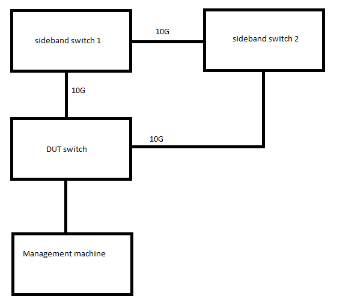
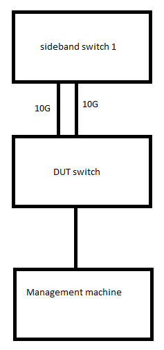
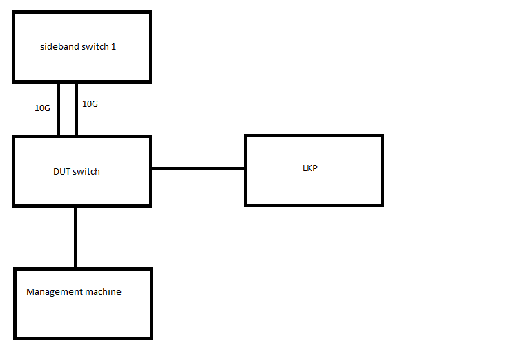

===================
L2 Switch Test Plan
===================

Test plan: some introduction text

Common L2 functionality
=======================

* MAC learning table
* Vlans
* STP/RSTP/MSTP
* Ingress/egress port mirroring
* Link aggregation
* RMON MIB counters
* Egress traffic shaping
* Jumbo frames
* IGMP/MLD snooping

MAC learning table verification
-------------------------------

| **Before test suite**
| Connect all switch ports to appropriate hosts
| Clear vlan configuration on the switch

| **Before each test**
| Clear MAC learning table on the switch

* Simple MAC learning table test

  #. Send packet through one of switch ports
  #. Check that new entry with packet source MAC address has been added to MAC learning table

* Multiple MACs

  #. Send 7 broadcast packets with different source MAC addresses through the first switch port
  #. Check that 7 new entries have been added to MAC learning table
  #. Send the same packets through the other switch port
  #. Check that 7 entries have been assigned to the corresponding switch port. Make sure that obsolete switch entries for the first port have been removed/disabled
  #. Repeat the procedure for all switch ports

* Max size of MAC learning table

  #. Send 8000 broadcast packets with different source MAC addresses over one switch port
  #. Check traffic loses on any RX host. There should be no traffic loses
  #. On the switch check the number of stored MAC addresses is 8000.
  #. Check missed MAC addresses on the switch. Should be no missed addresses
  #. Check MAC addresses mapping in MAC address table
  #. Repeat the procedure for all switch ports

* MAC learning table overflow

  #. Send 8000 packets with different source MAC addresses over one switch port
  #. Send another one packet with different source MAC address
  #. Make sure that MAC learning table contains 8000 entries
  #. Make sure that the oldest entry is replaced by 8001th packet source MAC address

* MAC learning when a group of ports physically not connected (manual)

  #. Connect 2 ports on the switch to the hosts. The rest ports are not connected.
  #. Send 8000 broadcast packets with different source MAC addresses
  #. Check traffic loses (should be no packets lost on RX side)
  #. Connect 3rd port. Repeat the procedure in 1-3 paragraphs
  #. By incrementing the number of connected ports repeat the procedure in 1-3 paragraphs

* Dublicate MAC addresses on different ports

  #. Send a packet through the switch port 0
  #. Check a corresponding MAC table entry appears
  #. Send a packet with the same MAC address to the other switch ports one after another
  #. Check the MAC address is mapped to the corresponding switch port in MAC table correctly.
     There should be no similar MAC addresses mapped to different ports.
     There should be no dublicated MAC addresses on any port

* Working with source multicast/broadcast addresses

  #. Prepare list of source multicast MAC addresses + broadcast https://en.wikipedia.org/wiki/Multicast_address
  #. For each address send packet with this source MAC address
  #. Check that addresses were not learned ???????

* MAC learning table entry timeout

  #. Enable MAC address ager on the switch
  #. Set ager timeout 15 sec
  #. Send a packet to switch port 0. Check MAc table
  #. Make sure that new entry has been added to Mac table
  #. Wait 15 sec. Check Mac table again
  #. Make sure that the entry has been removed from MAC table
  #. Repeat the test for all switch ports

* Static MAC entry

  #. Add static MAC address assigned to port 0 on the switch
  #. Send a packet with this destination MAC to the switch
  #. Make sure that the packet is received on appropriate host connected to corresponding port on the switch
  #. Verify validity of MAC table
  #. Repeat the test for all ports on the switch

* Port based hardware learn limiting (from 1 to 255 per port)

* Port based static forward table - ??? (is not included in requirements, but exists)

Vlan verification
-----------------

| **Before each test**
| Clear vlan configuration on the switch
| Clear MAC learning table on the switch

* Untagged traffic to untagged port

  #. Send 1 packet to any switch port
  #. Make sure that this packet has been flooded to all other switch ports

* Untagged traffic to tagged port

  #. Setup vlan tag 11 on some switch port
  #. Send 1 untagged packet through this port
  #. Make sure that this packet has been flooded to all other switch ports

* Untagged traffic to multiple tagged port

  #. Setup several vlan tags on some switch port
  #. Send 1 untagged packet through this port
  #. Make sure that this packet has been flooded to all other switch ports

* Tagged traffic to untagged port (no vlans at all on port)

* Tagged traffic to tagged by different vlan id port

* Tagged traffic to tagged interface

* Max number of vlan tags on one port

* Max number of vlan tags on different ports

* Max number + 1 of vlan tags on different ports

* Multiple tagged traffic to multiple tagged port

* Untagged traffic to untagged port forwards to tagged port (egress tagging)

* Tagged traffic to tagged port forwards to untagged port (egress untagging)

* IEEE 802.1Q-in-Q VLAN Tag Termination (double tagging)

* Native vlan verification (double tagging attack)

RSTP
----

* Topology 1

* Election of Root Bridge

  #. * Action - Switch on RSTP on all switches.
     * Result - Convergence time < 10 sec. Root bridge is the bridge with lowest MAC address
  #. * Action - Set priority on DUT from 32768 to 8192. Set RSTP on test vlan for all 3 switches
     * Result - DUT switch is the Root bridge. Convergence time < 10 secs. Ports on DUT is designated
  #. * Action - Return priority back to default values
     * Result - Root bridge is the switch with lowest MAC address
  #. Override MAC address of DUT - ???

* Change path costs

  #. * Action - set RSTP on all switches. Assign lowest bridge ID to Switch 1.
     * Result - RSTP is set. Switch 1 is the Root bridge. The loop is broken between DUT and switch 2
  #. * Action - change link between DUT and switch 1 from 10g to 100Mb
     * Result - Link between DUT and switch 2 raises up. Port connected to switch 2 becomes a root port. Port connected to switch 1 becomes in alternate state. Convergence time from 6 up to 10 sec
  #. * Action - Replace 100Mb link with 10g back to initial configuration
     * Result - RSTP tree converges to initial state

* React on network failure

  #. * Action - set RSTP on all switches. Assign lowest bridge ID to Switch 1.
     * Result - RSTP is set. Switch 1 is the Root bridge. The loop is broken between DUT and switch 2
  #. * Action - remove link between DUT and switch 1.
     * Result - Link between DUT and switch 2 raises up. Port connected to switch 2 becomes a root port. Convergence time from 6 up to 10 sec

* Local loop

  #. * Action - Connect link from one port to another on DUT. Enable RSTP
     * Result - RSTP enabled

* Topology 2

* Link agregation (PAgP, LACP)

  #. * Action - switch on RSTP on agregated etherchannel
     * Result - Bundle behaves as a single link
  #. * Action - Disable/remove one link
     * Result - traffic not affected

* Topology 3

* PortFast (if supported)

  #. Enable portfast on edge port
  #. Disable edge port.
  #. * Action - Enable edge port. Check port states changing
     * Result - Edge port should become to forwarding state immediate after discarding state skipping learning state

* BPDU Guard

* Root Guard

* Uplink Fast & Backbone Fast - ??

MSTP
----
Due to automotive specific it assumes that there are no any other switches except DUT switch in the car. Multiregion scpecific issues could not be tested,
because its used for large topologies with many switches.
Usability of MST is load-balanced multi-VLAN configuration.
The tests below are made for single-region MST.

Use topology 1

* Elect regional root bridge

* Assign regional root bridge

* Check load balancing for IST without VLANs

* Check load balancing for IST with VLANs in IST

* Check network failures for IST

* Check load balancing for MST instances with VLANs

  #. Action - Set MST for switches. Create VLANs 2-201. Create 2 MST instances. Assign VLANs 2-100 to instance 1 and VLANs 101-201 to instance 2.
  #. Action - assign primary root for instance 1 on DUT. Primary root on instance 2 on switch 1.
  #. * Action - check MST.
     * Result - instances should be load-balanced. Different spanning trees should be converged for different instances

* Check network failures (affected MST instance should fall back to redundant link)

* Check change port states and port roles

Ingress and Egress port mirroring
---------------------------------

* Ingress mirroring from one port to another

* Ingress mirroring from one port to multiple ports

* Ingress mirroring from multiple ports to another

* Ingress mirroring from multiple ports to multiple ports

* Egress mirroring from one port to another

* Egress mirroring from one port to multiple ports

* Egress mirroring from multiple ports to another

* Egress mirroring from multiple ports to multiple ports

* Ingress and egress mirroring from one port to another

* Ingress and egress mirroring from one port to multiple ports

* Ingress and egress mirroring from multiple ports to another

* Ingress and egress mirroring from multiple ports to multiple ports

* Ingress and egress mirroring from one port to the same port (negative test)

Link aggregation
----------------

* Aggregate 2 links with Static configuration and default load-balancing settings, check traffic by sending it to some other switch port

* Aggregate 4 links with Static configuration and default load-balancing settings, check traffic by sending it to some other switch port

* Aggregate 2 links with LACP Active configuration and default load-balancing settings, check traffic by sending it to some other switch port

* Aggregate 4 links with LACP Passive configuration and default load-balancing settings, check traffic by sending it to some other switch port

* Aggregate 4 links with LACP Active configuration and 4 links with LACP Passive, send traffic via aggregated interfaces

* Aggregate 2 links with Static cfg on one side and 4 links with LACP passive cfg on other side, send traffic via aggregated interfaces

* Aggregate 2 links with Static cfg on one side and 2 links with Static cfg on other side, send traffic via aggregated interfaces

* Test mixing of static/active/passive modes in the aggregation

* Manual tests (because it's impossible to assembly forever such setups):
  * Aggregate 3 links
  * Aggregate 5 links
  * Aggregate 6 links
  * Aggregate 7 links
  * Aggregate 8 links

* Load balancing: [4-2] (aggregate 4 links on one side and 2 links on other side), cfg Static with source MAC load balancing, check traffic

* Load balancing: [2-2] (aggregate 1 links on one side and 2 links on other side), cfg LACP Active with destination MAC load balancing, check traffic

* Load balancing: [2-4], cfg LACP Passive with source IP load balancing, check traffic

* Load balancing: [2-4], cfg Static with destination IP load balancing, check traffic

* Load balancing: [2-2], cfg LACP Active with round-robin load balancing, check traffic

* Other load-balancing algorithms ??????

* Negative tests:
  * Half-duplex on both ends of one link inside of aggregation
  * Half-duplex on one end of one link inside of aggregation
  * Different aggregation modes on different ends of one link
  * Different link speeds ?????? -- works on windows server but not supported accorfing to rfc
  * Static mode, perform link down of any link in the aggregation
  * Dynamic mode (active/passive LACP, perform link down of any link in the aggregation)
  * Perform link down of all links of the aggregation, then link up, check that traffic is OK after that

RMON/MIB counters
-----------------------------

* Are 64bit MIB counters supported????

* Check alarm is raised for raising threshold

  #. Create an event. Create a log entry to be generated in case of event occurs. Create SNMP trap message to be sent.
     Result - The event is added to the RMON-1 Events group table.
  #. Create an alarm. Define the MIB object that needs to be monitored by the alarm, the interval for monitoring,
     the rising-threshold value, and the falling-threshold value. Define the event that are triggered when
     a rising-threshold value or falling-threshold value is crossed.
     Result - The alarm is added to the alarm table.
  #. Send traffic to monitored port. Number of sent packets should exceed rising-threshold.
     Result - alarm is triggered. Defined events also triggered. Log entry is generated. SNMP trap sent

* Check alarm is reset for falling threshold

  #. Perform previous test case
  #. Drop monitored counter
     Result - alarm is reset

* Set different rising-threshold and falling threshold for all ports. Check alarms and events.

* Check RMON setup via WEB interface (manual test) as well as via SNMP (can be automated)

Egress Rate Shaping
-------------------

| **Precondition**
| Install IPERF tool on each LKP

| **Before each test**
| Clear vlan configuration on the switch
| Clear MAC learning table on the switch
| Enable rate shaper

* Check default rate 10 Gbps

  #. Send traffic from port 0 to each port. Use IPERF. Send traffic for both directions
  #. Check the traffic rate is 10 Gbps

* Check default rate 5 Gbps

  #. Set shaper value 5 Gbps on each port
  #. Send traffic from port 0 to each port. Use IPERF. Send traffic for both directions
  #. Check the traffic rate is 5 Gbps

* Check default rate 2.5 Gbps

  #. Set shaper value 2.5 Gbps on each port
  #. Send traffic from port 0 to each port. Use IPERF. Send traffic for both directions
  #. Check the traffic rate is 2.5 Gbps

* Check default rate 1 Gbps

  #. Set shaper value 1 Gbps on each port
  #. Send traffic from port 0 to each port. Use IPERF. Send traffic for both directions
  #. Check the traffic rate is 1 Gbps

* Check default rate 500 Mbps

  #. Set shaper value 500 Mbps on each port
  #. Send traffic from port 0 to each port. Use IPERF. Send traffic for both directions
  #. Check the traffic rate is 500 Mbps

* Check default rate 100 Mbps

  #. Set shaper value 100 Mbps on each port
  #. Send traffic from port 0 to each port. Use IPERF. Send traffic for both directions
  #. Check the traffic rate is 100 Mbps

Jumbo frames
------------

* 1.5kB transmit from one to one

  #. Configure 2 ports to 1,5kB
  #. Send 1 frame 1,5kB from 1st LKP to 2nd LKP
  #. Check the frame is transmitted

* 2kB transmit from one to one

  #. Configure 2 ports to 2kB
  #. Send 1 frame 2kB from 1st LKP to 2nd LKP
  #. Check the frame is transmitted

* Jumbo (9000B) transmit from one to one

  #. Configure MTU 9000 on LKPs
  #. Configure 2 ports to 9000B
  #. Send 1 jumbo frame from 1st LKP to 2nd LKP
  #. Check the frame is transmitted
  #. Send 1 million jumbo frames from one to one

* 1,5kB from one to many

* 2kB from one to many

* Jumbo from one to many

* Send oversize MTU

  #. Configure 1,5kB
  #. Send 2kB. Check drop
  #. Configure 2kB
  #. Send 9000. Check drop
  #. Configure jumbo
  #. Send >9000 MTU. Check drop

IGMP snooping
-------------

| Multicast Router Discovery https://tools.ietf.org/html/rfc4286
| Considerations for Internet Group Management Protocol (IGMP) and Multicast Listener Discovery (MLD) Snooping Switches https://tools.ietf.org/html/rfc4541

* Building list of multicast routers (1)

  #. For each switch port send General Query v3 message
  #. Check that switch extended list of multicast routers with entry for appropriate port 

* Building list of multicast routers (2)

  #. For each switch port send General Query v2 message
  #. Check that switch extended list of multicast routers with entry for appropriate port 

* Building list of multicast routers (3)

  #. For each switch port send General Query v1 message
  #. Check that switch extended list of multicast routers with entry for appropriate port 

* Building list of multicast routers (4) (negative)

  #. For each switch port send General Query v3 message with invalid destination address 224.0.0.2
  #. Check that switch didn't extend list of multicast routers

* Building list of multicast routers (5) (negative)

  #. For each switch port send General Query v3 message with invalid source address 0.0.0.0
  #. Check that switch didn't extend list of multicast routers

* Building list of multicast routers (6) (negative)

  #. For each switch port send corrupted General Query v3 message
  #. Check that switch didn't extend list of multicast routers

* Building list of multicast routers (7)

  #. For each switch port send Multicast Router Advertisement message 
  #. Check that switch extended list of multicast routers with entry for appropriate port 

* Building list of multicast routers (8) (negative)

  #. For each switch port send corrupted Multicast Router Advertisement message 
  #. Check that switch didn't extend list of multicast routers

* Building list of multicast routers (9)

  #. For each switch port check that switch periodically sends Multicast Router Solicitation messages

* Building list of multicast routers (10)

  #. For each switch port try to add them to the list manually

* Forwarding IGMP Membership Reports (1) (negative)

  #. Send Membership Report v3 message to all switch ports
  #. Make sure that Membership Report is not forwarded anywhere (because there are no rules for that)

* Forwarding IGMP Membership Reports (2) (negative)

  #. Send General Query v3 message to 1st switch port (to simulate register multicast router attachment)
  #. Send Membership Report v3 message with source address 0.0.0.0 to 2nd switch port
  #. Make sure that Membership Report is forwarded to all switch ports (proxy-reporting feature)

* Forwarding IGMP Membership Reports (3) (negative)

  #. Send General Query v3 message to 1st switch port (to simulate register multicast router attachment)
  #. Send Membership Report v3 message with invalid checksum (test for IP and IGMP checksums) to 2nd switch port
  #. Make sure that Membership Report is not forwarded anywhere

* Forwarding IGMP Membership Reports (4)

  #. Send General Query v3 message to 1st switch port (to simulate register multicast router attachment)
  #. Send Membership Report v3 message to 2nd switch port
  #. Make sure that Membership Report is forwarded ONLY to 1st switch port

* Forwarding IGMP Membership Reports (5)

  #. Send General Query v3 message to 1st switch port (to simulate register multicast router attachment)
  #. Send General Query v2 message to 2nd switch port (to simulate register multicast router attachment)
  #. Send Membership Report v3 message to all switch ports
  #. Make sure that Membership Reports are forwarded ONLY to 1st and 2nd switch ports
  #. Send Membership Report v2 message to all switch ports
  #. Make sure that Membership Reports are forwarded ONLY to 1st and 2nd switch ports

* Forwarding IGMP Membership Reports (6)

  #. Send General Query v3 message to 1st switch port (to simulate register multicast router attachment)
  #. Send General Query v2 message to 2nd switch port (to simulate register multicast router attachment)
  #. Send General Query v1 message to 3rd switch port (to simulate register multicast router attachment)
  #. Send Membership Report v3 message to all switch ports
  #. Make sure that Membership Reports are forwarded ONLY to 1st, 2nd and 3rd switch ports
  #. Send Membership Report v2 message to all switch ports
  #. Make sure that Membership Reports are forwarded ONLY to 1st, 2nd and 3rd switch ports
  #. Send Membership Report v1 message to all switch ports
  #. Make sure that Membership Reports are forwarded ONLY to 1st, 2nd and 3rd switch ports

* Forwarding unrecognized IGMP messages

  #. Send several unrecognized IGMP messages to all switch ports
  #. Make sure that they are forwarded to all other switch ports

* Aware of STP topology

  #. TTTTTTTTTTTTTTTTTTTTTTTTTTTTTTTO BE DONE

* Data forwarding for IP addresses outside 224.0.0.X (1)

  #. Send General Query v3 message to 1st switch port (to simulate register multicast router attachment)
  #. Send Membership Report v3 message for address 224.0.1.1 to 2nd switch port
  #. Send Membership Report v3 message for address 224.0.2.2 to 3rd switch port
  #. Send Membership Report v3 message for address 224.3.0.3 to 4th switch port
  #. Send multicast IP packet with dest address 224.0.1.1 to 5th swith port
  #. Check that it was forwarded to 1st and 2nd switch ports only
  #. Send multicast IP packet with dest address 224.0.2.2 to 6th swith port
  #. Check that it was forwarded to 1st and 3rd switch ports only
  #. Send multicast IP packet with dest address 224.3.0.3 to 7th swith port
  #. Check that it was forwarded to 1st and 4rd switch ports only

* Data forwarding for IP addresses outside 224.0.0.X (2)

  #. Send General Query v3 message to 1st switch port (to simulate register multicast router attachment)
  #. Send General Query v3 message to 2nd switch port (to simulate register multicast router attachment)
  #. Send Membership Report v3 message for address 232.0.1.6 to 3rd switch port
  #. Send Membership Report v3 message for address 233.1.1.1 to 4th switch port
  #. Send Membership Report v3 message for address 233.252.1.2 to 5th switch port
  #. Send multicast IP packet with dest address 232.0.1.6 to 6th swith port
  #. Check that it was forwarded to 1st, 2nd and 3rd switch ports only
  #. Send multicast IP packet with dest address 233.1.1.1 to 6th swith port
  #. Check that it was forwarded to 1st, 2nd and 4th switch ports only
  #. Send multicast IP packet with dest address 233.252.1.2 to 6th swith port
  #. Check that it was forwarded to 1st, 2nd and 5th switch ports only

* Data forwarding for IP addresses outside 224.0.0.X (3)

  #. Send Membership Report v3 message for address 234.3.3.3 to 1st switch port
  #. Send Membership Report v3 message for address 234.7.7.7 to 1th switch port
  #. Send Membership Report v3 message for address 239.5.5.5 to 2nd switch port
  #. Send Membership Report v3 message for address 239.9.9.9 to 2nd switch port
  #. Send multicast IP packet with dest address 234.3.3.3 to 2nd swith port
  #. Check that it was forwarded to 1st switch port only
  #. Send multicast IP packet with dest address 234.3.3.3 to 1st swith port
  #. Check that it was not forwarded anywhere
  #. Send multicast IP packet with dest address 234.7.7.7 to 6th swith port
  #. Check that it was forwarded to 1st switch port only
  #. Send multicast IP packet with dest address 239.5.5.5 to 5th swith port
  #. Check that it was forwarded to 2nd switch port only
  #. Send multicast IP packet with dest address 239.9.9.9 to 1th swith port
  #. Check that it was forwarded to 2nd switch port only

* Data forwarding for IP addresses inside 224.0.0.X

  #. Send Membership Report v2 message for address 224.0.0.1 to 1st switch port
  #. Send multicast IP packet with dest address 224.0.0.1 to 2nd swith port
  #. Make sure that packet is forwarded to all others ports
  #. Send multicast IP packet with dest address 224.0.0.1 with incorrect IP header checksum to 5th swith port
  #. Make sure that packet is not forwarded anywhere

* Data forwarding for unregistered multicast packets (1)

  #. Send multicast IP packet with dest address 224.0.1.1 to 2nd swith port
  #. Make sure that packet is not forwarded anywhere

* Data forwarding for unregistered multicast packets (2)

  #. Send General Query v3 message to 1st switch port (to simulate register multicast router attachment)
  #. Send General Query v3 message to 2nd switch port (to simulate register multicast router attachment)
  #. Send multicast IP packet with dest address 224.0.1.1 to 3rd swith port
  #. Make sure that packet is forwarded to 1st and 2nd ports only
  #. Send multicast IP packet with dest address 224.0.1.1 with incorrect IP header checksum to 6th swith port
  #. Make sure that packet is not forwarded anywhere

* Data forwarding for non-IPv4 multicast packets

  #. Send IPv6 multicast packet to 1st port
  #. Make sure that it's forwarded to all remaining ports

* IGMPv3 "include source" and "exclude source" membership reports

  #. TTTTTTTTTTTTTTTTTTTTTTTTTTTTTTTO BE DONE

MLD snooping
------------

| Multicast Listener Discovery Version 2 (MLDv2) for IPv6 https://tools.ietf.org/html/rfc3810
| Considerations for Internet Group Management Protocol (IGMP) and Multicast Listener Discovery (MLD) Snooping Switches https://tools.ietf.org/html/rfc4541
| MLD snooping tests are very similar to IGMP snooping. Thay are copy-pasted with adaptation for IPv6.

* Building list of multicast routers (1)

  #. For each switch port send General Query MLDv2 message
  #. Check that switch extended list of multicast routers with entry for appropriate port 

* Building list of multicast routers (2)

  #. For each switch port send Multicast Address Specific Query MLDv2 message
  #. Check that switch extended list of multicast routers with entry for appropriate port 

* Building list of multicast routers (3)

  #. For each switch port send Multicast Address and Source Specific Query MLDv2 message
  #. Check that switch extended list of multicast routers with entry for appropriate port 

* Building list of multicast routers (4)

  #. For each switch port send General Query MLDv1 message
  #. Check that switch extended list of multicast routers with entry for appropriate port

* Building list of multicast routers (5) (negative)

  #. For each switch port send General Query MLDv2 message with invalid source address (any real IPv6 address)
  #. Check that switch didn't extend list of multicast routers

* Building list of multicast routers (6) (negative)

  #. For each switch port send General Query MLDv2 message with invalid destination address (any real IPv6 address)
  #. Check that switch didn't extend list of multicast routers

* Building list of multicast routers (7) (negative)

  #. For each switch port send corrupted General Query MLDv2 message
  #. Check that switch didn't extend list of multicast routers

* Building list of multicast routers (8)

  #. For each switch port send Multicast Router Advertisement message 
  #. Check that switch extended list of multicast routers with entry for appropriate port 

* Building list of multicast routers (9) (negative)

  #. For each switch port send corrupted Multicast Router Advertisement message 
  #. Check that switch didn't extend list of multicast routers

* Building list of multicast routers (10)

  #. For each switch port check that switch periodically sends Multicast Router Solicitation messages

* Building list of multicast routers (11)

  #. For each switch port try to add them to the list manually

* Forwarding MLD Multicast Listener Reports (1) (negative)

  #. Send Multicast Listener Report MLDv2 message to all switch ports
  #. Make sure that Multicast Listener Report is not forwarded anywhere (because there are no rules for that)

* Forwarding MLD Multicast Listener Reports (2) (negative)

  #. Send General Query MLDv2 message to 1st switch port (to simulate register multicast router attachment)
  #. Send Multicast Listener Report MLDv2 message with invalid checksum (test for ICMPv6 checksum) to 2nd switch port
  #. Make sure that Multicast Listener Report is not forwarded anywhere

* Forwarding MLD Multicast Listener Reports (3)

  #. Send General Query MLDv2 message to 1st switch port (to simulate register multicast router attachment)
  #. Send Multicast Listener Report MLDv2 message to 2nd switch port
  #. Make sure that Multicast Listener Report is forwarded ONLY to 1st switch port

* Forwarding MLD Multicast Listener Reports (4)

  #. Send General Query MLDv2 message to 1st switch port (to simulate register multicast router attachment)
  #. Send General Query MLDv1 message to 2nd switch port (to simulate register multicast router attachment)
  #. Send Multicast Listener Report MLDv2 message to all switch ports
  #. Make sure that Multicast Listener Reports are forwarded ONLY to 1st and 2nd switch ports
  #. Send Multicast Listener Report MLDv1 message to all switch ports
  #. Make sure that Multicast Listener Reports are forwarded ONLY to 1st and 2nd switch ports

* Forwarding MLD Multicast Listener Reports (5) (negative)

  #. Send General Query MLDv2 message to 1st switch port (to simulate register multicast router attachment)
  #. Send Multicast Listener Report MLDv2 message with source address :: (all zero) to 2nd switch port
  #. Make sure that  Multicast Listener Report Report is forwarded to all switch ports (proxy-reporting feature)

* Forwarding unrecognized MLD messages

  #. Send several unrecognized MLD messages to all switch ports
  #. Make sure that they are forwarded to all other switch ports

* Aware of STP topology

  #. TTTTTTTTTTTTTTTTTTTTTTTTTTTTTTTO BE DONE

* Data forwarding for IPv6 addresses FF02::1 (all hosts link scope)

  #. Send IPv6 multicast packet with dest address FF02::1 to 1st port
  #. Make sure that the packet is forwarded to all remain switch ports

* Data forwarding for multicast IPv6 addresses

  #. Send IPv6 multicast packet with dest address FF02::1 to 1st port
  #. Make sure that the packet is forwarded to all remain switch ports

802.1Qbb Priority based flow control
------------------------------------

| https://www.iol.unh.edu/sites/default/files/testsuites/dcb/802.1Qbb_Priority-based_Flow_Control_Test_Suite_(v2.0).pdf

* Reception of PFC frames

  #. Start transmitting large number of valid frames from one LKP_1 to another LKP_2 through 1st and 2nd switch ports
  #. Instruct LKP_2 to issue valid PFC frame to switch port 2
  #. Verify that PFC frame is not forwarded to any other switch port
  #. Verify that switch halts transmission for requested pause quanta

* Reception of multiple PFC frames

  #. Start transmitting large number of valid frames from one LKP_1 to another LKP_2 through 1st and 2nd switch ports
  #. Instruct LKP_2 to issue valid PFC frame to switch port 2 with max timer_vector value 65535
  #. Immediatelly instruct LKP_2 to issue valid PFC frame to switch port 2 with min timer_vector value 0
  #. Verify that switch properly begins transmittion after receiving 2nd pause frame

* Reception of multiple priority PFC frames

  #. Start transmitting large number of valid frames for different traffic classes from one LKP_1 to another LKP_2 through 1st and 2nd switch ports
  #. Instruct LKP_2 to issue valid PFC frame to switch port 2 for each traffic class
  #. Verify that switch halts transmission for each traffic class after receiving appropriate pause frame

* Reception of PFC frame with priority_enable_vector set to zero

  #. Start transmitting large number of valid frames from one LKP_1 to another LKP_2 through 1st and 2nd switch ports
  #. Instruct LKP_2 to issue valid PFC frame to switch port 2 with the priority_enable_vector field set to 0 and timer_vector field set to the maximum value
  #. Verify that switch doesn't pause traffic on any priority

* Reception of invalid PFC frame (wrong destination MAC address)

  #. Start transmitting large number of valid frames from one LKP_1 to another LKP_2 through 1st and 2nd switch ports
  #. Instruct LKP_2 to issue invalid PFC frame to switch port 2 with wrong broadcast, multicast and unicast MAC addresses
  #. Verify that switch doesn't pause traffic

* Reception of invalid opcode PFC Frames

  #. Start transmitting large number of valid frames from one LKP_1 to another LKP_2 through 1st and 2nd switch ports
  #. Instruct LKP_2 to transmit invalid opcode PFC frames to the switch including: 01-02 through 01-07 and reserved opcodes
  #. Verify that switch doesn't pause traffic

* Reception of invalid priority_enable_vector PFC Frames
  #. Start transmitting large number of valid frames from one LKP_1 to another LKP_2 through 1st and 2nd switch ports
  #. Instruct LKP_2 to transmit invalid and valid priority_enable_vector PFC frames to the switch including a series of non-zero values in the most significant octet (MSO)
  #. Verify that switch halts transmission even invalid value is set in MSO

* Reception of PAUSE frames after PFC negotiation

  #. Start transmitting large number of valid frames from one LKP_1 to another LKP_2 through 1st and 2nd switch ports
  #. Instruct the LKP_2 to transmit properly formatted PAUSE frames
  #. Verify that switch doesn't pause traffic

* Reception of invalid CRC PFC Frames
  #. Start transmitting large number of valid frames from one LKP_1 to another LKP_2 through 1st and 2nd switch ports
  #. Instruct LKP_2 to transmit properly formatted PFC frames with an invalid CRC to the switch
  #. Verify that switch doesn't pause traffic

* Reception of oversized PFC Frames

  #. Start transmitting large number of valid frames from one LKP_1 to another LKP_2 through 1st and 2nd switch ports
  #. Instruct LKP_2 to transmit oversized PFC frames (check different sizes)
  #. DROP OR NOT, THATS THE QUESTION

* Reception of undersized PFC Frames

  #. Start transmitting large number of valid frames from one LKP_1 to another LKP_2 through 1st and 2nd switch ports
  #. Instruct LKP_2 to transmit undersized PFC frames (check different sizes)
  #. DROP OR NOT, THATS THE QUESTION

* Transmission of PFC Frames

  #. Issue the switch to transmit PFC frame by for example sending huge amount of traffic from LKP with minimal IFG
  #. Make sure that PFC frame is transmitted

* Reception of PFC frame for same priority in different vlan ids

  #. Start transmitting large number of valid frames from one LKP_1 to another LKP_2 through 1st and 2nd switch ports with (same traffic class but different vlan ids)
  #. Instruct LKP_2 to issue valid PFC frame to switch port 2 for all traffic classes
  #. Verify that the switch properly pauses the traffic in both VLAN IDs with the same priority

* Reception of PFC frame for different priority in different vlan ids

  #. Start transmitting large number of valid frames from one LKP_1 to another LKP_2 through 1st and 2nd switch ports with (one vlan id and one priority)
  #. Instruct LKP_2 to issue valid PFC frame to the priority of the vlan id NOT being transmitted
  #. Verify that the switch does not pause the traffic of the first vlan id and priority
